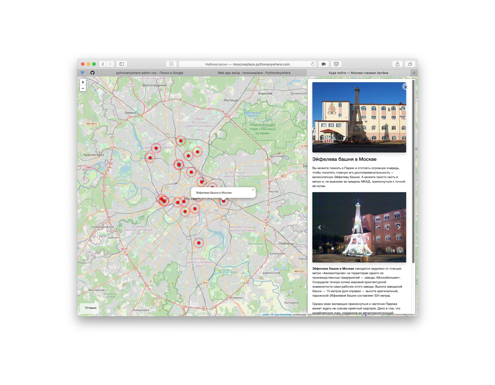
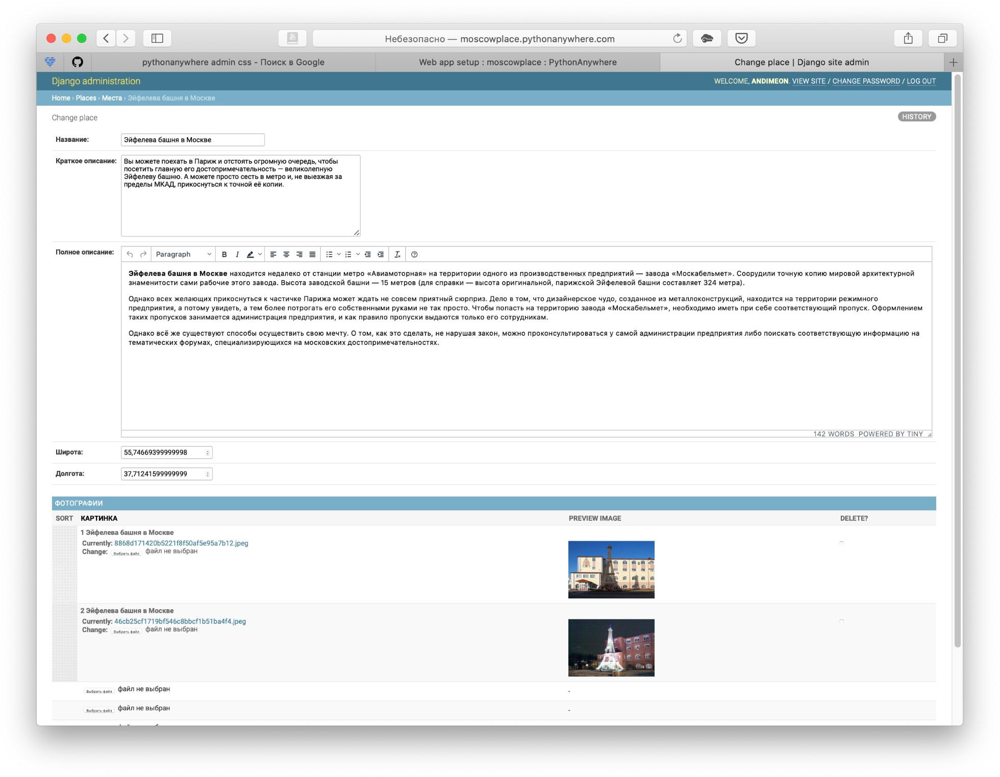

# Куда пойти — Москва глазами Артёма

Личный блог, показывающий интересные места на карте.

## Описание

[Сайт]() представляет подборку интересных мест в Москве



Оптимизирован для просмотра на различных устройствах.


Наполнение сайта происзодит через специальную [панель администратора]().



## Как запустить на локальном компьютере

Скачайте код. Создайте файл с переменными окружения `.env` и положите его рядом с `manage.py`. Доступны 2 переменные окружения: `SECRET_KEY`, `ALLOWED_HOSTS`.

Используйте `pip` для установки зависимостей:

```bash
pip install -r requirements.txt
```

Запустите миграцию базы данных и веб-сервер командой:

```bash
python manage.py migrate
python manage.py runserver
```

## Используемые библиотеки

* [Leaflet](https://leafletjs.com/) — отрисовка карты
* [loglevel](https://www.npmjs.com/package/loglevel) для логгирования
* [Bootstrap](https://getbootstrap.com/) — CSS библиотека
* [Vue.js](https://ru.vuejs.org/) — реактивные шаблоны на фронтенде

Тестовые данные взяты с сайта [KudaGo](https://kudago.com).