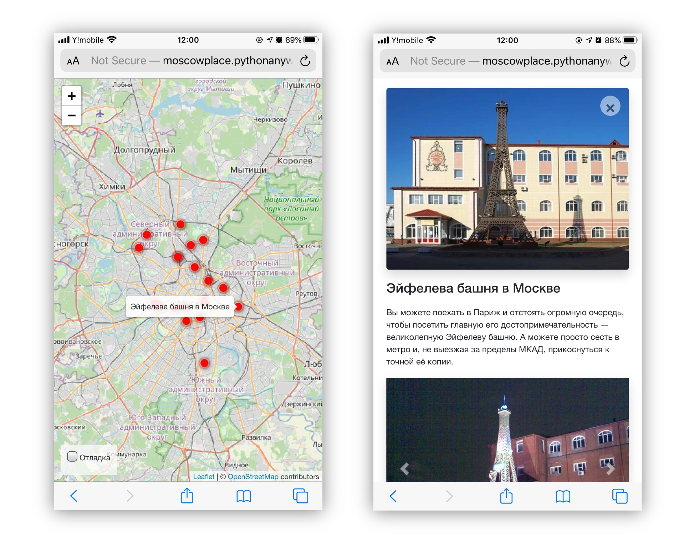

# Куда пойти — Москва глазами Артёма

Личный блог, показывающий интересные места на карте.

## Описание

[Сайт](https://inmedvedev.pythonanywhere.com/) представляет подборку интересных мест в Москве


Оптимизирован для просмотра на различных устройствах.



Наполнение сайта происзодит через специальную [панель администратора](https://inmedvedev.pythonanywhere.com/admin/).


## Как запустить на локальном компьютере

Скачайте код. Создайте файл с переменными окружения `.env` и положите его рядом с `manage.py`. Доступны 2 переменные окружения: `SECRET_KEY`, `ALLOWED_HOSTS`.

Используйте `pip` для установки зависимостей:

```bash
pip install -r requirements.txt
```

Запустите миграцию базы данных и веб-сервер командой:

```bash
python manage.py migrate
python manage.py runserver
```

Загрузите нужные вам локации. 

```
python manage.py load_place https://raw.githubusercontent.com/devmanorg/where-to-go-places/master/places/%D0%90%D0%BD%D1%82%D0%B8%D0%BA%D0%B0%D1%84%D0%B5%20Bizone.json

```
[Пример json файла](https://raw.githubusercontent.com/devmanorg/where-to-go-places/master/places/%D0%AF%D0%BF%D0%BE%D0%BD%D1%81%D0%BA%D0%B8%D0%B9%20%D1%81%D0%B0%D0%B4.json).

## Используемые библиотеки

* [Leaflet](https://leafletjs.com/) — отрисовка карты
* [loglevel](https://www.npmjs.com/package/loglevel) для логгирования
* [Bootstrap](https://getbootstrap.com/) — CSS библиотека
* [Vue.js](https://ru.vuejs.org/) — реактивные шаблоны на фронтенде

Тестовые данные взяты с сайта [KudaGo](https://kudago.com).

## Цели проекта

Код написан в учебных целях — это урок в курсе по Python и веб-разработке на сайте [Devman](https://dvmn.org).